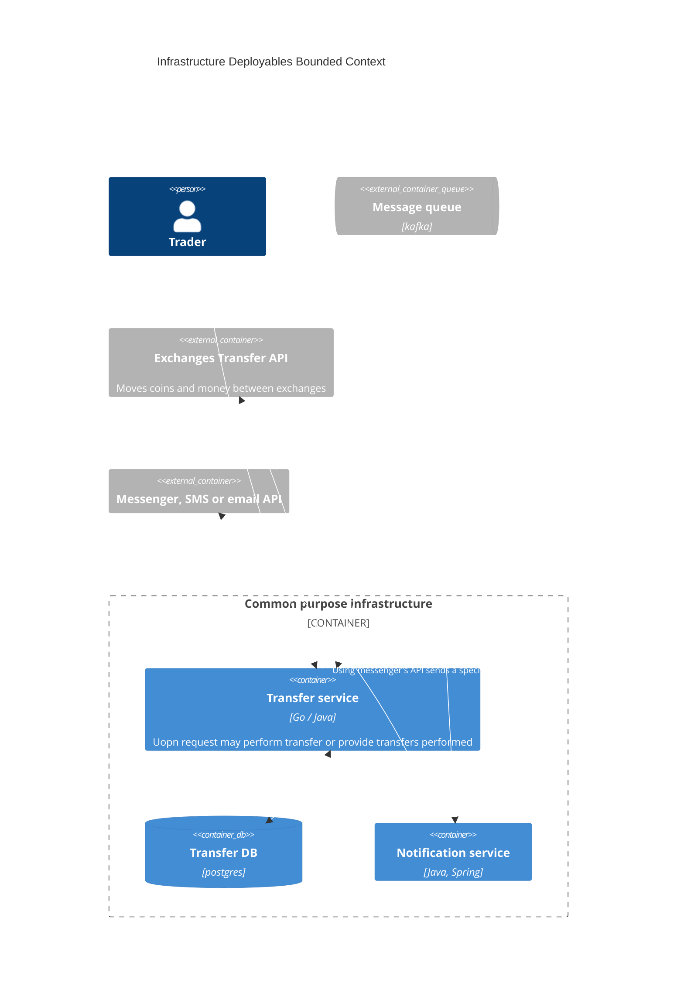

```mermaid
    C4Context
    title Infrastructure Deployables Bounded Context
    
    Person(trader, "Trader")
    ContainerQueue_Ext(mq, "Message queue", "kafka")
    Container_Ext(exchanges, "Exchanges Transfer API", "", "Moves coins and money between exchanges")
    Container_Ext(messenger, "Messenger, SMS or email API")


    Container_Boundary(с1, "Common purpose infrastructure") {
        Container(transfer, "Transfer service", "Go / Java", "Uopn request may perform transfer or provide transfers performed")
        ContainerDb(transferDb, "Transfer DB", "postgres")
        Container(notification, "Notification service", "Java, Spring")
    }

    Rel(mq, notification, "Event to send a notification")
    Rel(mq, transfer, "Event to perform a transfer. Must be performed unless it's outdated")
    Rel(trader, transfer, "May check and monitor transfers")
    BiRel(transfer, transferDb, "")
    Rel(transfer, exchanges, "Perform coin / money transfer")
    Rel(notification, messenger, "Using messenger's API sends a specific message")

    UpdateRelStyle(mq, notification, $textColor="white", $lineColor="white", $offsetX="5")
    UpdateRelStyle(mq, transfer, $textColor="white", $lineColor="white", $offsetX="5")
    UpdateRelStyle(trader, transfer, $textColor="white", $lineColor="white", $offsetX="5")
    UpdateRelStyle(transfer, transferDb, $textColor="white", $lineColor="white", $offsetX="5")
    UpdateRelStyle(transfer, exchanges, $textColor="white", $lineColor="white", $offsetX="5")
    UpdateRelStyle(notification, messenger, $textColor="white", $lineColor="white", $offsetX="5")
    
```