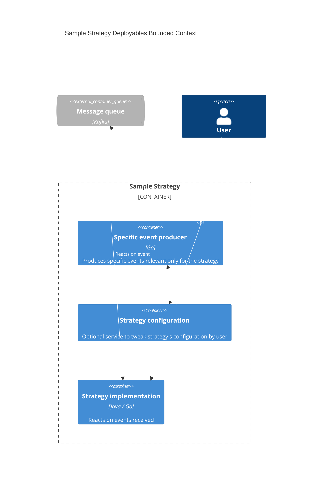

```mermaid
    C4Context
    title Sample Strategy Deployables Bounded Context
    
    ContainerQueue_Ext(mq, "Message queue", "Kafka")

    Container_Boundary(с1, " Sample Strategy") {
        Container(eventProducer, "Specific event producer", "Go", "Produces specific events relevant only for the strategy")
        Container(configuration, "Strategy configuration", "", "Optional service to tweak strategy's configuration by user")
        Container(strategy, "Strategy implementation", "Java / Go", "Reacts on events received")
    }
    Person(trader, "User")
    Rel(mq, strategy, "Reacts on event")
    Rel(eventProducer, mq, "Puts specific event type")
    Rel(configuration, strategy, "Configures")
    Rel(configuration, eventProducer, "Configures")
    Rel(trader, configuration, "api")

    UpdateRelStyle(mq, strategy, $textColor="white", $lineColor="white", $offsetX="5")
    UpdateRelStyle(eventProducer, mq, $textColor="white", $lineColor="white", $offsetX="5")
    UpdateRelStyle(configuration, strategy, $textColor="white", $lineColor="white", $offsetX="5")
    UpdateRelStyle(configuration, eventProducer, $textColor="white", $lineColor="white", $offsetX="5")
    UpdateRelStyle(trader, configuration, $textColor="white", $lineColor="white", $offsetX="5")

    UpdateLayoutConfig($c4ShapeInRow="2", $c4BoundaryInRow="1") 
```