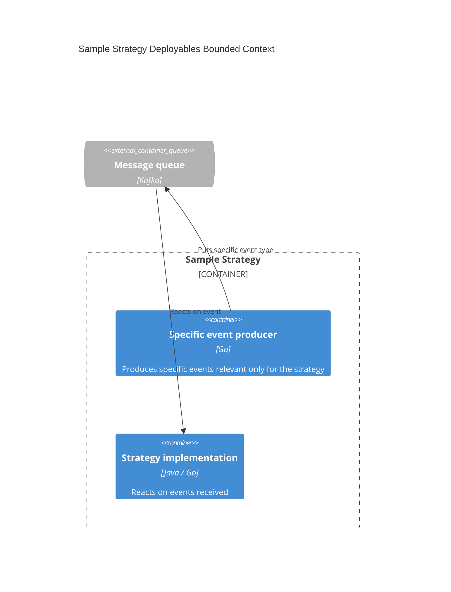

```mermaid
    C4Context
    title Sample Strategy Deployables Bounded Context
    
    ContainerQueue_Ext(mq, "Message queue", "Kafka")

    Container_Boundary(с1, " Sample Strategy") {
        Container(eventProducer, "Specific event producer", "Go", "Produces specific events relevant only for the strategy")
        Container(strategy, "Strategy implementation", "Java / Go", "Reacts on events received")
    }
    
    Rel(mq, strategy, "Reacts on event")
    Rel(eventProducer, mq, "Puts specific event type")
```