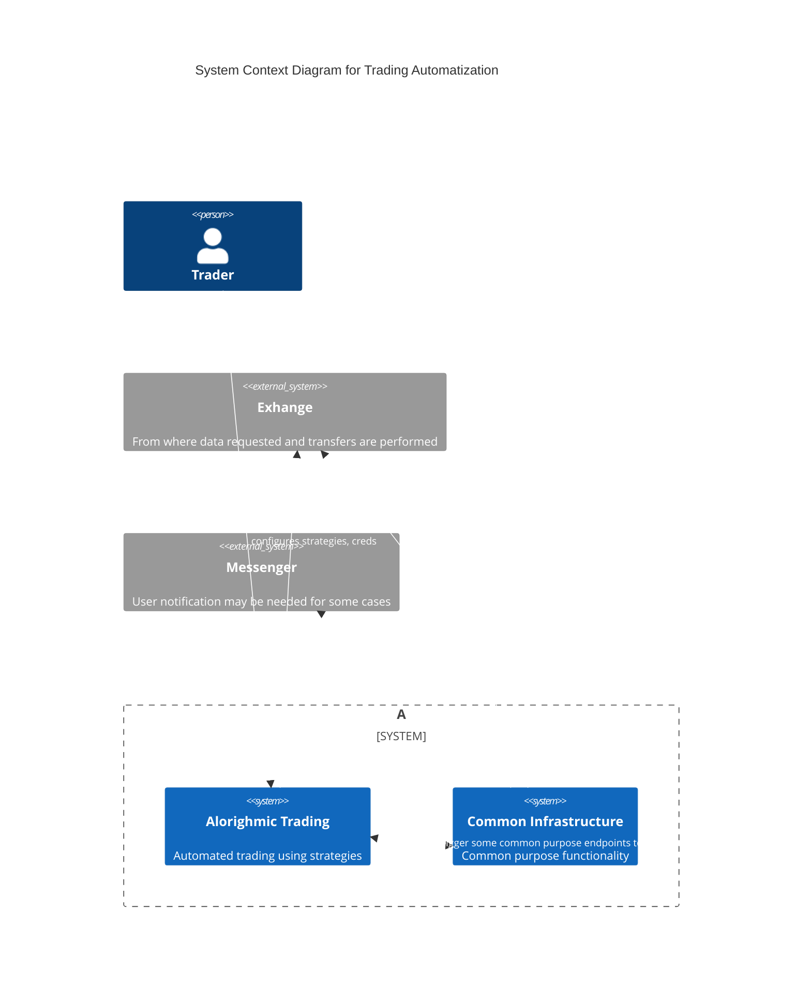

```mermaid
    C4Context
    title System Context Diagram for Trading Automatization

    Person(trader, "Trader")
    System_Ext(exchanges, "Exhange", "From where data requested and transfers are performed")
    System_Ext(messenger, "Messenger", "User notification may be needed for some cases")
     System_Boundary(b1, "A") {
            System(algoTrading, "Alorighmic Trading", "Automated trading using strategies")
            System(infrastructure, "Common Infrastructure", "Common purpose functionality")
        }

    Rel(trader, algoTrading, "configures strategies, creds")
    Rel(algoTrading, exchanges, "pulls data")
    BiRel(algoTrading, infrastructure, "may trigger some common purpose endpoints to send a message or perform transfer")
    Rel(infrastructure, messenger, "may send notifications")
    Rel(infrastructure, exchanges, "Requests transfers")

    UpdateRelStyle(trader, algoTrading, $textColor="white", $lineColor="white", $offsetX="5")
    UpdateRelStyle(algoTrading, exchanges, $textColor="white", $lineColor="white", $offsetX="5")
    UpdateRelStyle(algoTrading, infrastructure, $textColor="white", $lineColor="white", $offsetX="5")
    UpdateRelStyle(infrastructure, messenger, $textColor="white", $lineColor="white", $offsetX="5")
    UpdateRelStyle(infrastructure, exchanges, $textColor="white", $lineColor="white", $offsetX="5")

```